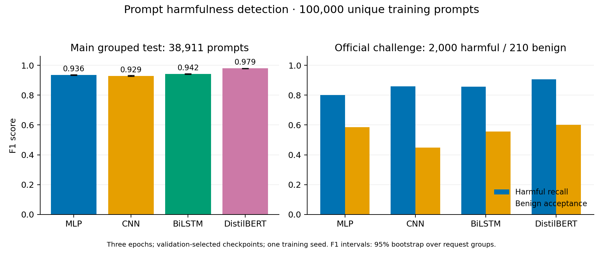

# LLM prompt detection

This project compares four models for detecting harmful prompts: a TF–IDF MLP, a sentence CNN, a BiLSTM, and DistilBERT. It includes data preparation, training, evaluation, and inference from the published checkpoints.

The current experiment uses 100,000 unique training prompts from [WildJailbreak](https://huggingface.co/datasets/allenai/wildjailbreak). All four models completed three epochs on the same split. DistilBERT was fine-tuned across the full encoder and classification head.

[Models on Hugging Face](https://huggingface.co/DeeAxe/llm-prompt-detection) · [Detailed results](results/large/README.md) · [Training settings](TRAINING_PLAN.md)

## Results

The shared test set contains 38,911 prompts. The official challenge provides a further 2,000 harmful and 210 benign prompts.

| Model | Test accuracy | Test F1 | Official harmful recall | Official benign acceptance |
| --- | ---: | ---: | ---: | ---: |
| TF–IDF MLP | 0.9353 | 0.9355 | 0.8000 | 0.5857 |
| CNN | 0.9258 | 0.9290 | 0.8585 | 0.4476 |
| BiLSTM | 0.9410 | 0.9423 | 0.8570 | 0.5571 |
| DistilBERT | 0.9789 | 0.9792 | 0.9055 | 0.6000 |



DistilBERT has the highest test F1, but rejects 40% of benign prompts in the official challenge. False positives remain a major issue. These runs use one training seed and mostly synthetic data. Further work will cover longer training, larger datasets and models, repeated seeds, and inference speed.

The labels describe prompt harmfulness. Evaluating prompt injection will require a separate experiment with application context.

## Setup

The recorded runs use Python 3.10 and PyTorch 2.5.1. From the repository root:

```bash
python3.10 -m venv .venv
source .venv/bin/activate
pip install torch==2.5.1 --index-url https://download.pytorch.org/whl/cu121
pip install -r requirements-training.txt
```

For a CPU installation, use `https://download.pytorch.org/whl/cpu` as the PyTorch index URL. Model inference uses CPU by default; add `--device cuda` to use an NVIDIA GPU.

## Run inference

Load a model from the published Hugging Face repository:

```bash
python src/predict_large_models.py \
  --repo-id DeeAxe/llm-prompt-detection \
  --model distilbert \
  --text "Explain how rainbows form."
```

Choose `mlp`, `cnn`, `bilstm`, or `distilbert`. The helper downloads the selected checkpoint and preprocessing files, caches them, and runs inference locally. It returns the harmfulness probability, predicted label, and model revision as JSON. Label 0 is benign and label 1 is harmful; the decision threshold is 0.5.

Use `--revision COMMIT_SHA` to select a particular release, `--offline` to load an already cached release, or `--root /path/to/model-repository` to use a downloaded folder.

You can also call the helper from Python:

```python
from src.predict_large_models import PromptClassifier

classifier = PromptClassifier.from_hub(
    "DeeAxe/llm-prompt-detection", architecture="distilbert"
)
scores = classifier.probabilities([
    "Explain how rainbows form.",
    "Summarize this article.",
])
```

## Prepare the dataset

Accept the WildJailbreak access terms on Hugging Face and authenticate with `hf auth login`. Download the pinned source files, then prepare and audit the corpus:

```bash
hf download allenai/wildjailbreak train/train.tsv eval/eval.tsv README.md \
  --repo-type dataset --revision 5ddc12a7894f842b0619b8e1c7ee496b198af009 \
  --local-dir data/raw/large/wildjailbreak --cache-dir data/.hf-cache
python src/prepare_large_corpus.py
python src/audit_large_corpus.py
```

Preparation removes normalized duplicates and conflicting labels, keeps each original request with its adversarial variants, and selects 100,000 unique training prompts. Validation contains 39,502 prompts. Model responses are excluded from the inputs.

The audit checks exact prompt overlap across all partitions and underlying-request overlap across the main splits. The official evaluation omits the original request identifiers, so its overlap check is limited to exact text. Counts, source revisions, and file hashes are saved in [the data manifest](results/large/data_manifest.json).

## Train the models

Run the MLP on CPU and the sequence models on GPU:

```bash
OPENBLAS_NUM_THREADS=1 OMP_NUM_THREADS=1 python src/train_large_mlp.py
python src/train_large_neural.py cnn --device cuda
python src/train_large_neural.py bilstm --device cuda
```

For full DistilBERT fine-tuning locally:

```bash
python src/download_encoder.py
python src/train_large_neural.py distilbert \
  --device cuda --batch-size 32 --epochs 3
```

Each run selects its checkpoint using validation F1. The input limit is 256 tokens; MLP, CNN, and BiLSTM use regex tokens, while DistilBERT uses WordPiece. Vocabulary and TF–IDF statistics are fitted on training data only. Checkpoints and predictions are saved under `artifacts/large/`, and aggregate metrics under `results/large/`.

The completed MLP run used local CPU, CNN and BiLSTM used an RTX 3060, and DistilBERT used one Kaggle T4. [TRAINING_PLAN.md](TRAINING_PLAN.md) records the model configurations, hardware, and training budgets.

### Train DistilBERT on Kaggle

The Kaggle package contains the prepared partitions, pretrained encoder, and training scripts. Authenticate the Kaggle CLI and replace `YOUR_USERNAME` with your account name:

```bash
uv tool install kaggle --python 3.11
python src/download_encoder.py
python src/package_kaggle.py --username YOUR_USERNAME
kaggle datasets create -p kaggle/input --keep-tabular
kaggle datasets status YOUR_USERNAME/wildjailbreak-100k-grouped
```

Once the dataset is ready, submit the training job:

```bash
kaggle kernels push -p kaggle/distilbert --accelerator NvidiaTeslaT4
kaggle kernels status YOUR_USERNAME/prompt-detection-distilbert-100k
python src/collect_kaggle_run.py \
  --kernel YOUR_USERNAME/prompt-detection-distilbert-100k --watch
```

The collector verifies the partition hashes and encoder fine-tuning checks before importing the checkpoint and results.

## Evaluate and compare

After all four runs are available locally:

```bash
python src/compare_large_results.py
python src/export_large_models.py
pip install matplotlib
python src/plot_large_results.py
python -m unittest discover -s tests -v
```

The comparison checks that all models used the same partitions and prediction identifiers. It produces a results table, CSV, and paired bootstrap intervals over test request groups. Per-model JSON files include validation history, classification and calibration metrics, data-type slices, parameter counts, timings, and file hashes.

## Repository layout

| Path | Contents |
| --- | --- |
| `src/` | Data preparation, training, evaluation, and inference scripts |
| `tests/` | Checks for data handling, metrics, and model behavior |
| `results/large/` | Current 100,000-row experiment and release records |
| `results/` | Earlier small-corpus results |
| `kaggle/distilbert/` | Kaggle training entry point |

Raw data, processed prompts, checkpoints, and prediction files stay in ignored local folders. Published checkpoints are hosted on Hugging Face.

The earlier DAN/JailbreakBench/Alpaca experiment remains available through `src/run_experiments.py` and [its results summary](results/README.md). It used 1,764 training prompts and a frozen DistilBERT encoder. [DATA_STRATEGY.md](DATA_STRATEGY.md) explains the length and template overlap issues that led to the larger experiment.

## License

Project code is released under the [MIT license](LICENSE). Dataset and pretrained-model licenses are listed in their source documentation and the [model repository](https://huggingface.co/DeeAxe/llm-prompt-detection/blob/main/LICENSE.md).
